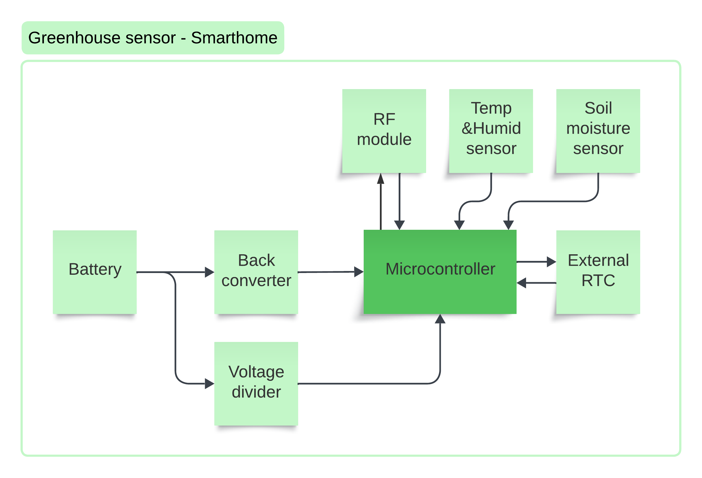

# GreenhouseSensor_SmartHome

## Project Overview
**GreenhouseSensor_SmartHome** is a smart sensor system designed to monitor and control environmental factors within a greenhouse. The system provides real-time data on soil moisture, air humidity, and temperature to a central control module. This data is used to automate the irrigation process and regulate the greenhouse's internal temperature by controlling a water valve and a motor-driven window.

## Key Features
- **Soil Moisture Measurement**: Monitors the moisture level in the soil to optimize irrigation.
- **Air Humidity and Temperature Monitoring**: Provides environmental data to help regulate the greenhouse climate.
- **RF Communication**: Transmits sensor data wirelessly to a central control unit every 60 seconds.
- **Battery Powered**: Uses an 18650 Li-ion battery for power, designed to operate for at least 5 months on a single charge.
- **Battery Voltage Measurement**: Monitors battery voltage to ensure power efficiency and notify when replacement is needed.
- **Easy Battery Replacement**: Simplified battery replacement process for maintenance.

## System Design
This system is designed solely to provide sensor data to a master module. It collects soil moisture, air humidity, and temperature data and transmits it wirelessly via an RF module to the central control unit. The master module is responsible for decision-making and control actions such as operating the motor for the greenhouse window and controlling the irrigation system.

## Assumptions
- Soil moisture, temperature, and humidity sensors provide reliable data for greenhouse monitoring.
- The RF communication module effectively transmits data within the greenhouse environment.
- The system is powered by an 18650 battery, with an operational life of at least 5 months per charge.
- The master module handles all control decisions, based on the data received from the sensor module.